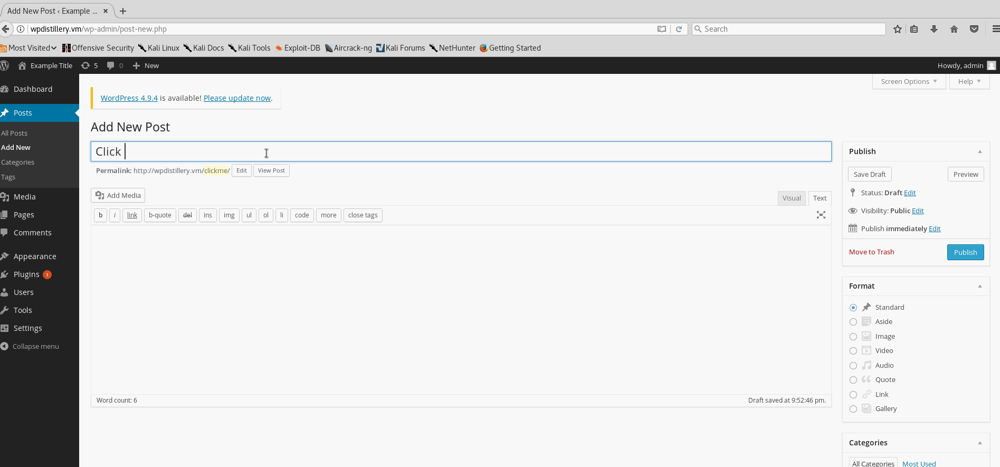
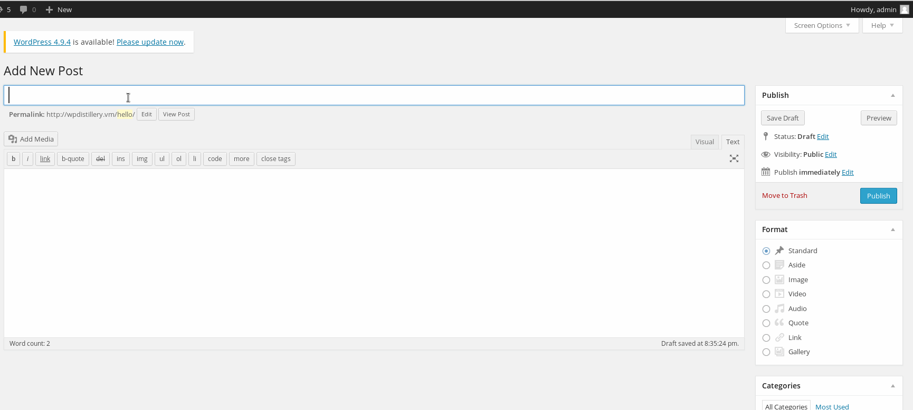
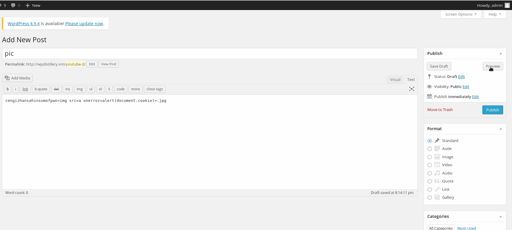
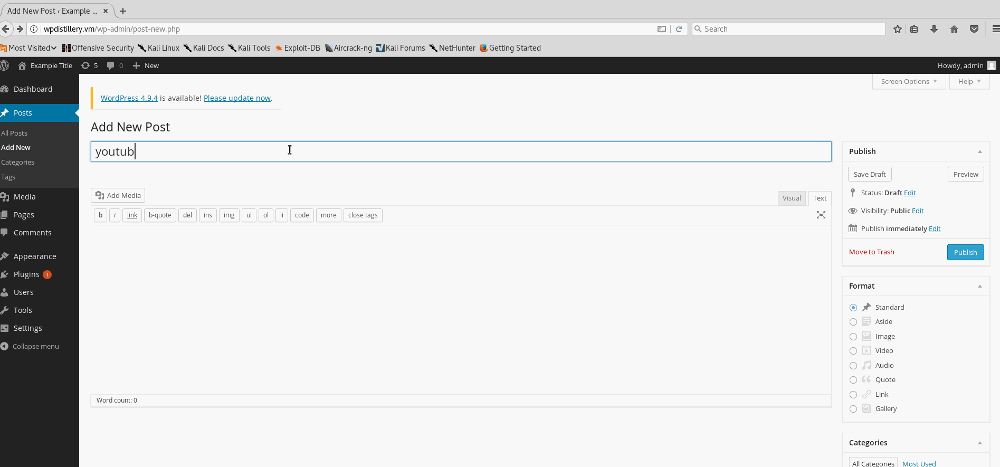

# Project 7 - WordPress Pentesting

Time spent: **8** hours spent in total

> Objective: Find, analyze, recreate, and document **five vulnerabilities** affecting an old version of WordPress

## Pentesting Report

1. (Required) Vulnerability Name or ID: 4.3 - Authenticated Shortcode Tags Cross-Site Scripting (XSS)
  - [X] Summary: 
    - Vulnerability types:XSS
    - Tested in version:4.0
    - Fixed in version: 4.3
  - [X] GIF Walkthrough:
    - 
  - [X] Steps to recreate: 
    - add a new post
    - insert ```TEST!!![caption width="1" caption='<a href="' ">]</a><a href="http://onMouseOver='alert(1)'">Click me</a>``` on the context
    - publish and view post or click on preview
  - [X] Affected source code:
    - [Link 1](http://blog.knownsec.com/2015/09/wordpress-vulnerability-analysis-cve-2015-5714-cve-2015-5715/)
    - [Link 2](http://blog.checkpoint.com/2015/09/15/finding-vulnerabilities-in-core-wordpress-a-bug-hunters-trilogy-part-iii-ultimatum/)
1. (Required) Vulnerability Name or ID: 4.2.2 - Authenticated Stored Cross-Site Scripting (XSS)
  - [X] Summary: 
    - Vulnerability types:XSS
    - Tested in version:4.0
    - Fixed in version:4.2.2 
  - [X] GIF Walkthrough: 
    - 
  - [X] Steps to recreate: 
    - add a new post
    - insert ```<a href="[caption code=">]</a><a title=" onmouseover=alert('XAIO_HE') ">link</a>``` on the context
    - publish and view post or click on preview
  - [X] Affected source code:
    - [Link 1](https://klikki.fi/adv/wordpress3.html)
1. (Required) Vulnerability Name or ID: 2.5-4.6 - Authenticated Stored Cross-Site Scripting via Image Filename
  - [X] Summary: 
    - Vulnerability types:XSS
    - Tested in version:4.0
    - Fixed in version:4.6 
  - [X] GIF Walkthrough: 
    - 
  - [X] Steps to recreate: 
    - add a new post
    - insert ```cengizhansahinsumofpwn.jpg``` on the context
    - publish and view post or click on preview
  - [X] Affected source code:
    - [Link 1](https://sumofpwn.nl/advisory/2016/persistent_cross_site_scripting_vulnerability_in_wordpress_due_to_unsafe_processing_of_file_names.html)
1. (Optional) Vulnerability Name or ID: 4.0-4.7.2 - Authenticated Stored Cross-Site Scripting (XSS) in YouTube URL Embeds
  - [X] Summary: 
    - Vulnerability types:XSS
    - Tested in version:4.0
    - Fixed in version: 4.7.2
  - [X] GIF Walkthrough: 
    - 
  - [X] Steps to recreate: 
    - add a new post
    - insert ```https://youtube[.]com/watch?v=abc<svg onload=alert(1)>``` on the context
    - publish and view post or click on preview
  - [X] Affected source code:
    - [Link 1](https://blog.sucuri.net/2017/03/stored-xss-in-wordpress-core.html)
1. (Optional) Vulnerability Name or ID
  - [X] Summary: 
    - Vulnerability types:User Enumeration
    - Tested in version:4.0
    - Fixed in version: 
  - [X] GIF Walkthrough: 
    - 
  - [X] Steps to recreate: 
    - On the login page, anyone has the ability to find a list of valid user names on a WordPress site
  - [] Affected source code:
## Assets

List any additional assets, such as scripts or files

## Resources

- [WordPress Source Browser](https://core.trac.wordpress.org/browser/)
- [WordPress Developer Reference](https://developer.wordpress.org/reference/)

GIFs created with [LiceCap](http://www.cockos.com/licecap/).

## Notes


## License

    Copyright [2018] [Jinhui Zhuo]

    Licensed under the Apache License, Version 2.0 (the "License");
    you may not use this file except in compliance with the License.
    You may obtain a copy of the License at

        http://www.apache.org/licenses/LICENSE-2.0

    Unless required by applicable law or agreed to in writing, software
    distributed under the License is distributed on an "AS IS" BASIS,
    WITHOUT WARRANTIES OR CONDITIONS OF ANY KIND, either express or implied.
    See the License for the specific language governing permissions and
    limitations under the License.
